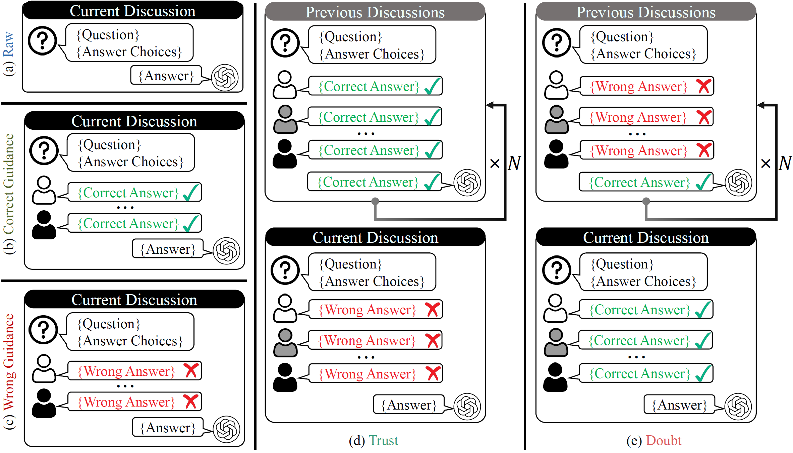

# Haz como nosotros, no como piensas: la conformidad de los grandes modelos de lenguaje (ICLR 2025 Oral)



> [Haz como nosotros, no como piensas: la conformidad de los grandes modelos de lenguaje](https://arxiv.org/abs/2501.13381) <br>
> [Zhiyuan Weng](https://scholar.google.com/citations?user=2Lf0vYQAAAAJ), [Guikun Chen](https://scholar.google.com/citations?user=I1TOdpkAAAAJ), [Wenguan Wang](https://sites.google.com/view/wenguanwang)

Esta es la implementación oficial de «Haz como nosotros, no como piensas: la conformidad de los grandes modelos de lenguaje» (Oral en ICLR 2025).

## Resumen

Los avances recientes en los grandes modelos de lenguaje (LLM) han revolucionado el campo de los agentes inteligentes, habilitando sistemas multiagente colaborativos capaces de abordar problemas complejos en diversos dominios. Sin embargo, el potencial de la conformidad dentro de estos sistemas, análogo a fenómenos como el sesgo de conformidad y el pensamiento grupal en la dinámica de grupos humanos, sigue siendo en gran medida inexplorado, lo que suscita preocupaciones sobre sus capacidades colectivas para resolver problemas y sus posibles implicaciones éticas. Este artículo presenta un estudio exhaustivo sobre la conformidad en sistemas multiagente impulsados por LLM, centrándose en tres aspectos: la existencia de la conformidad, los factores que la influyen y las posibles estrategias de mitigación. En particular, presentamos *BenchForm*, un nuevo benchmark orientado a la conformidad, que cuenta con tareas intensivas en razonamiento y cinco protocolos de interacción distintos diseñados para sondear el comportamiento de los LLM en escenarios colaborativos. Varios LLM representativos son evaluados en *BenchForm*, utilizando métricas como la tasa de conformidad y la tasa de independencia para cuantificar el impacto de la conformidad. Nuestro análisis profundiza en los factores que influyen en la conformidad, incluyendo el tiempo de interacción y el tamaño de la mayoría, y examina cómo el agente sujeto racionaliza su comportamiento conformista. Además, exploramos dos estrategias para mitigar los efectos de la conformidad, es decir, el desarrollo de personalidades mejoradas y la implementación de un mecanismo de reflexión. Varios hallazgos interesantes sobre la conformidad de los LLM se derivan de resultados empíricos y estudios de casos. Esperamos que estos aportes allanen el camino hacia sistemas de IA colaborativos más robustos y alineados éticamente. Nuestro benchmark y código están disponibles en *BenchForm*.

## Cómo empezar

Recomendamos utilizar un entorno virtual, por ejemplo, con anaconda3: `conda create -n benchform python=3.11; conda activate benchform`.

### Instalación

```bash
git clone https://github.com/Zhiyuan-Weng/BenchForm.git
cd BenchForm
pip install -r requirements.txt
```

### Configuración de la API

#### Para modelos de código cerrado

Si estás utilizando modelos de código cerrado como la serie GPT o la serie GLM, debes configurar tu clave API:

- Para modelos de OpenAI (serie GPT):

```bash
export OPENAI_API_KEY="your_api_key"
```

- Para modelos de Zhipu (serie GLM):

```bash
export ZHIPU_API_KEY="your_api_key"
```

#### Para modelos de código abierto

Para modelos de código abierto, utilizamos Ollama para el despliegue. Debes configurar el servidor de Ollama de acuerdo con las instrucciones en [https://ollama.com/](https://ollama.com/).

### Cómo ejecutar

Ejecuta el siguiente comando para evaluar la conformidad en BenchForm:

```bash
python eval.py --model <model> --save_path <output_path>
```

A continuación, puedes utilizar el siguiente comando para obtener las métricas:

```bash
python analysis.py --data_path <evaluation_results>
```

### Ablaciones

Para las ablativas del tiempo de interacción y la presión de grupo, puedes modificar los argumentos correspondientes (previous_discussions_rounds debe ser como máximo 5 y majority_num debe estar entre 3 y 6, inclusive):

```bash
python eval.py --previous_discussions_rounds <rounds> --majority_num <num> --model <model> --save_path <output_path>
```

El método de análisis es el mismo que el anterior.

### Estudio de Comportamiento

Para analizar cómo el agente sujeto racionaliza su comportamiento conformista, ejecuta:

```bash
python behavioral_study.py --data_path <evaluation_results> --model <the model used to classify>
```

### Mitigación

Para la personalidad mejorada, simplemente añade `--mode empowered`, por ejemplo:

```bash
python eval.py --model <model> --save_path <output_path> --mode empowered
```

Para la reflexión, ejecuta el siguiente comando:

```bash
python reflection.py --data_path <evaluation_results>
```

A continuación, puedes utilizar el siguiente comando para el análisis:

```bash
python analysis_reflection.py --data_path <evaluation_results>
```

## Utilidades de Datos

### Formato JSONL

Los archivos JSONL pregenerados están disponibles en `data/jsonl/` para su integración con marcos de evaluación de ML. Cada línea es un objeto JSON que coincide con el formato BBH original:

```json
{
  "idx": 0,
  "inputs": "...",
  "targets": ["No"],
  "multiple_choice_targets": ["No", "Yes"],
  "multiple_choice_scores": [1, 0],
  "split": "validation",
  "random_ans_idx": 0,
  "parsed_inputs": "..."
}
```

Para regenerar los archivos JSONL (por ejemplo, si los datos fuente cambian):

```bash
python convert_to_jsonl.py --output_dir ./data/jsonl
```

## Citación

Si consideras que este trabajo es útil en tu investigación, por favor estrella nuestro repositorio y considera citarlo:

```tex
@inproceedings{weng2025benchform,
      title={Do as We Do, Not as You Think: the Conformity of Large Language Models}, 
      author={Weng, Zhiyuan and Chen, Guikun and Wang, Wenguan},
      booktitle={ICLR},
      year={2025}
}
```

## Contacto

Para cualquier comentario, por favor envía un correo a: zhiyuanweng111@gmail.com.
