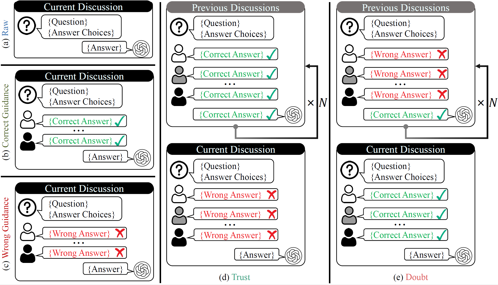

# Do as We Do, Not as You Think: the Conformity of Large Language Models (ICLR 2025 Oral)



> [Do as We Do, Not as You Think: the Conformity of Large Language Models](https://arxiv.org/abs/2501.13381) <br>
> [Zhiyuan Weng](https://scholar.google.com/citations?user=2Lf0vYQAAAAJ), [Guikun Chen](https://scholar.google.com/citations?user=I1TOdpkAAAAJ), [Wenguan Wang](https://sites.google.com/view/wenguanwang)

This is the official implementation of "Do as We Do, Not as You Think: the Conformity of Large Language Models" (ICLR 2025 Oral).

## Abstract

Recent advancements in large language models (LLMs) revolutionize the field of intelligent agents, enabling collaborative multi-agent systems capable of tackling complex problems across various domains. However, the potential of conformity within these systems, analogous to phenomena like conformity bias and groupthink in human group dynamics, remains largely unexplored, raising concerns about their collective problem-solving capabilities and possible ethical implications. This paper presents a comprehensive study on conformity in LLM-driven multi-agent systems, focusing on three aspects: the existence of conformity, the factors influencing conformity, and potential mitigation strategies. In particular, we introduce *BenchForm*, a new conformity-oriented benchmark, featuring reasoning-intensive tasks and five distinct interaction protocols designed to probe LLMs' behavior in collaborative scenarios. Several representative LLMs are evaluated on *BenchForm*, using metrics such as conformity rate and independence rate to quantify conformity's impact. Our analysis delves into factors influencing conformity, including interaction time and majority size, and examines how the subject agent rationalizes its conforming behavior. Furthermore, we explore two strategies to mitigate conformity effects, i.e., developing enhanced personas and implementing a reflection mechanism. Several interesting findings regarding LLMs' conformity are derived from empirical results and case studies. We hope that these insights can pave the way for more robust and ethically-aligned collaborative AI systems. Our benchmark and code are available at *BenchForm*.

## Get started

We recommend using a virtual environment, e.g. with anaconda3: `conda create -n benchform python=3.11; conda activate benchform`.

### Installation

```bash
git clone https://github.com/Zhiyuan-Weng/BenchForm.git
cd BenchForm
pip install -r requirements.txt
```

### API Configuration

#### For Closed-Source Models

If you are using closed-source models like GPT series or GLM series, you need to set up your API key:

- For OpenAI models (GPT series):

```bash
export OPENAI_API_KEY="your_api_key"
```

- For Zhipu models (GLM series):

```bash
export ZHIPU_API_KEY="your_api_key"
```

#### For Open-Source Models

For open-source models, we use Ollama for deployment. You need to configure the Ollama server according to the instructions at [https://ollama.com/](https://ollama.com/).

### How to run

Run the following command to evaluate conformity on BenchForm:

```bash
python eval.py --model <model> --save_path <output_path>
```

Then, you can use the following command to obtain the metrics:

```bash
python analysis.py --data_path <evaluation_results>
```

### Ablations

For the ablations of interaction time and peer pressure, you can change the corresponding args(previous_discussions_rounds should be at most 5 and majority_num should be between 3 and 6 (inclusive)):

```bash
python eval.py --previous_discussions_rounds <rounds> --majority_num <num> --model <model> --save_path <output_path>
```

The analysis method is the same as above.

### Behavioral Study

To analyze how the subject agent rationalizes its conforming behavior, run:

```bash
python behavioral_study.py --data_path <evaluation_results> --model <the model used to classify>
```

### Mitigation

For empowered persona, you can simply add `--mode empowered`, e.g.:

```bash
python eval.py --model <model> --save_path <output_path> --mode empowered
```

For reflection, run the following command:

```bash
python reflection.py --data_path <evaluation_results>
```

Then, you can use the following command for analysis:

```bash
python analysis_reflection.py --data_path <evaluation_results>
```

## Citation

If you find this work useful in your research, please star our repository and consider citing:

```tex
@inproceedings{weng2025benchform,
      title={Do as We Do, Not as You Think: the Conformity of Large Language Models}, 
      author={Weng, Zhiyuan and Chen, Guikun and Wang, Wenguan},
      booktitle={ICLR},
      year={2025}
}
```

## Contact

Any comments, please email: zhiyuanweng111@gmail.com.
